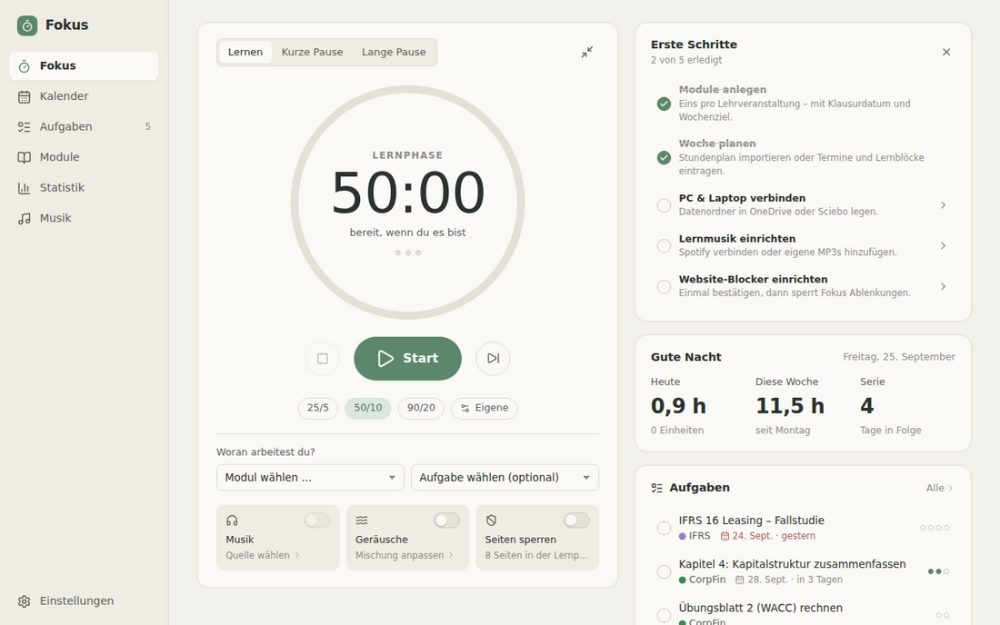
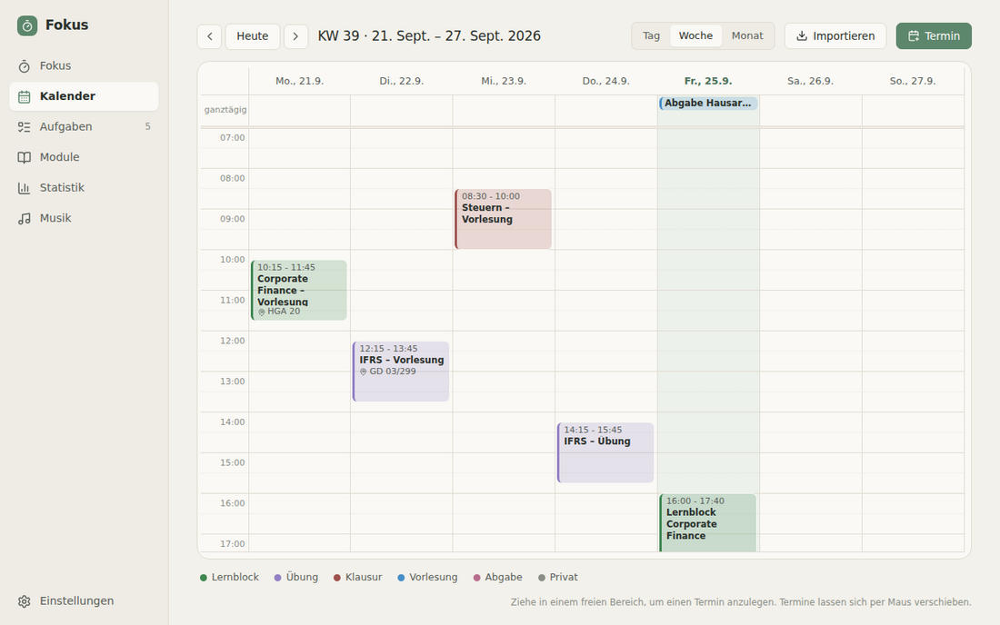
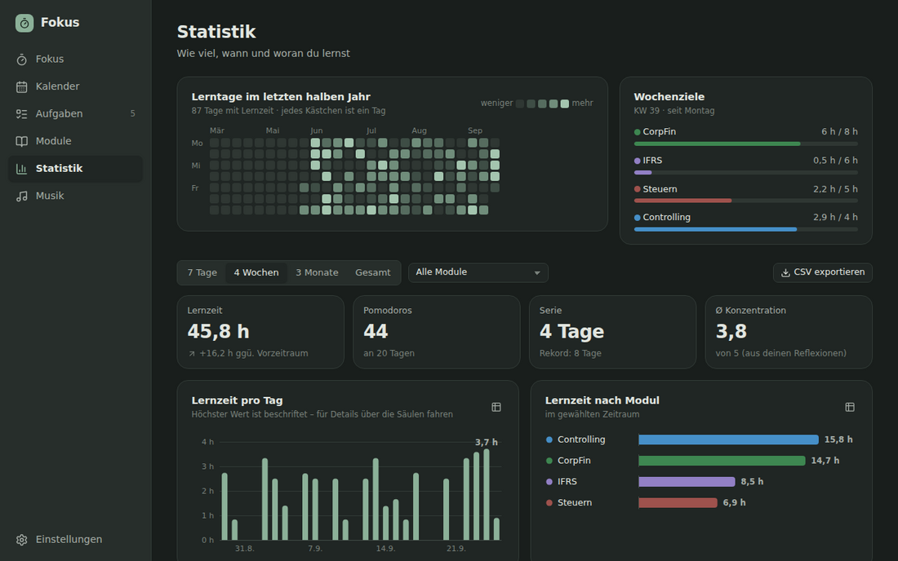
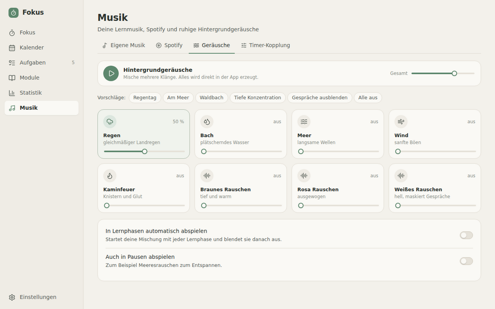

# Fokus

Eine ruhige Lern-App für Windows: Pomodoro-Timer, Wochenplanung, Aufgaben, Musik und Lernstatistik an einem Ort. Gebaut für einen strukturierten Unialltag.



| Kalender | Statistik (dunkel) | Geräusche |
|---|---|---|
|  |  |  |

*(Screenshots mit Beispieldaten)*

## Funktionen

| Bereich | Was Fokus kann |
|---|---|
| **Timer** | Pomodoro mit frei wählbaren Zeiten (z. B. 50/10), lange Pause nach n Einheiten, automatischer Phasenwechsel, Signalton und Windows-Benachrichtigung, Restzeit im Infobereich und als Fortschritt in der Taskleiste, **Mini-Timer**, der immer im Vordergrund bleibt |
| **Reflexion** | Nach jeder Lernphase: Wie gut war die Konzentration (1–5), was hast du geschafft? |
| **Module** | Farbe, ECTS, Klausurdatum mit Countdown, Wochenziel in Stunden |
| **Aufgaben** | Aufgaben pro Modul mit Schätzung in Pomodoros, Fälligkeitsdatum; direkt im Timer auswählen und abhaken |
| **Klausurplaner** | Kapitel und Aufwand eintragen → Fokus verteilt die Lernblöcke auf die freien Zeiten im Kalender bis zur Klausur; die letzten Tage bleiben für Wiederholung frei |
| **Kalender** | Tages-, Wochen- und Monatsansicht, Termine per Maus anlegen und verschieben, Serientermine (z. B. Vorlesungen), Import und Abo von iCal-Kalendern (.ics), „Jetzt lernen“ direkt aus einem Lernblock |
| **Musik** | Eigene MP3s mit Playlists, **Spotify-Steuerung** (Playlists auswählen, Play/Pause, Gerät wählen) und startet/pausiert automatisch mit dem Timer |
| **Geräusche** | Regen, Bach, Meer, Wind, Kaminfeuer, braunes/rosa/weißes Rauschen – frei mischbar, in der App erzeugt |
| **Website-Blocker** | Sperrt ablenkende Seiten (YouTube, Instagram, …) während der Lernphasen in allen Browsern |
| **Statistik** | Lerntage-Heatmap, Lernzeit pro Tag/Woche und Modul, Serien, Wochenziele, beste Tageszeit laut deinen Reflexionen, CSV-Export |
| **PC & Laptop** | Datenordner in OneDrive/Sciebo/Dropbox legen → beide Geräte nutzen dieselben Daten; tägliche Sicherungen |
| **Updates** | Fokus sucht selbst nach neuen Versionen und installiert sie mit einem Klick |

## Installation

1. Öffne auf GitHub **[Releases](https://github.com/Jdkdnfixks/Fokus/releases/latest)** und lade unter „Assets“ die Datei `Fokus_…_x64-setup.exe` herunter.
2. Datei ausführen. Administratorrechte sind nicht nötig.
3. Windows zeigt eventuell *„Der Computer wurde durch Windows geschützt“*, weil die App nicht kostenpflichtig signiert ist. Klicke auf **Weitere Informationen → Trotzdem ausführen**.

## Updates

Fokus aktualisiert sich selbst: Beim Start (und danach alle paar Stunden) prüft die App, ob es eine neue Version gibt. Dann erscheint oben der Hinweis **„Neue Version … ist verfügbar“** – ein Klick auf „Jetzt aktualisieren“ lädt das Update, installiert es und startet Fokus neu. Deine Daten bleiben erhalten, weil sie getrennt vom Programm im Datenordner liegen. Manuell suchen: **Einstellungen → System → Nach Updates suchen**.

So entsteht eine neue Version:

1. Eine Änderung wird auf den Standard-Branch gepusht.
2. GitHub Actions baut den Installer, signiert ihn und veröffentlicht ihn als Release `v0.2.<Build-Nummer>`.
3. Alle installierten Fokus-Apps (PC und Laptop) bieten das Update an.

Ein Release lässt sich auch von Hand anstoßen: **Actions → Build → Run workflow**.

### Einmalige Einrichtung des Update-Schlüssels

Updates werden signiert, damit die App nur echte Fokus-Updates installiert. Dafür braucht GitHub den privaten Schlüssel als *Secret*:

1. Im Repository **Settings → Secrets and variables → Actions → New repository secret** öffnen.
2. Name: `TAURI_SIGNING_PRIVATE_KEY`, Wert: der komplette Inhalt der Schlüsseldatei `fokus-update.key`.
3. Speichern. Der Schlüssel hat kein Passwort.

Bewahre die Schlüsseldatei zusätzlich sicher auf (z. B. im Passwortmanager). Geht sie verloren, muss einmalig ein neuer Schlüssel erzeugt und die App danach von Hand neu installiert werden. Der öffentliche Teil des Schlüssels steht in `src-tauri/tauri.conf.json`.

Fehlt das Secret, baut GitHub trotzdem einen Installer (unter „Actions → Lauf → Artifacts“), veröffentlicht aber kein Update.

## Einrichtung

### PC und Laptop synchronisieren
1. **Einstellungen → Daten & Synchronisation → Ordner ändern …** und einen Ordner in OneDrive oder Sciebo wählen (z. B. `OneDrive\Fokus`). Deine bisherigen Daten werden dorthin kopiert.
2. Auf dem zweiten Gerät denselben Ordner wählen und **„Diese Daten verwenden“** klicken.
3. Fokus möglichst nur auf einem Gerät gleichzeitig offen haben. Die App warnt, wenn sie auf dem anderen Gerät noch läuft, und fragt nach, falls sich Änderungen überschneiden.

Eigene MP3s liegen ebenfalls im Datenordner (Unterordner `musik`) und sind so auf beiden Geräten verfügbar.

### Spotify
Voraussetzung: **Spotify Premium** (Spotify erlaubt die Fernsteuerung nur damit).
1. **Musik → Spotify** öffnen und dem Assistenten folgen: im [Spotify Developer Dashboard](https://developer.spotify.com/dashboard) eine App anlegen, als Redirect URI `http://127.0.0.1:43821/callback` eintragen, „Web API“ auswählen.
2. Die **Client ID** in Fokus einfügen und „Mit Spotify verbinden“ klicken.
3. Bei einer Playlist auf den **Stern** klicken → sie läuft ab jetzt automatisch in deinen Lernphasen.

### Eigene Musik mit dem Timer
Sobald du MP3s hinzufügst, spielt Fokus sie automatisch in jeder Lernphase ab und pausiert sie in den Pausen – danach geht es an derselben Stelle weiter (praktisch bei langen Lernmixen). Mit **„Als Lernmusik“** auf der Musikseite legst du fest, welche Playlist läuft; unter **Musik → Timer-Kopplung** stellst du Quelle und Verhalten ein.

Fokus steuert die Spotify-App auf deinem PC. Ist Spotify nicht geöffnet, startet Fokus die App beim ersten Abspielen.

### Website-Blocker
1. **Einstellungen → Website-Blocker → Jetzt einrichten** und die Windows-Abfrage bestätigen (einmalig).
2. Blocker einschalten (auch direkt auf der Timer-Seite) und die Liste der Seiten anpassen.

Technisch trägt Fokus die Seiten während der Lernphase in die Windows-*hosts*-Datei ein und entfernt sie danach wieder – auch beim Beenden und nach einem Absturz beim nächsten Start. Die Einrichtung gibt nur deinem Windows-Konto Schreibrecht auf genau diese Datei; mit „Berechtigung entfernen“ nimmst du das jederzeit zurück.

### Stundenplan importieren
**Kalender → Importieren**: eine `.ics`-Datei wählen oder eine Kalender-Adresse abonnieren. Titel wie „Übung“ oder „Klausur“ werden als Termintyp erkannt, Module anhand ihres Namens oder Kürzels zugeordnet.

## Datenschutz

Alles bleibt lokal bzw. in deinem eigenen Cloud-Ordner. Fokus hat keinen Server und sammelt keine Daten. Nur für Spotify und abonnierte Kalender werden die jeweiligen Dienste direkt angesprochen; die Spotify-Zugangsdaten bleiben auf dem jeweiligen Gerät.

## Entwicklung

Voraussetzungen: [Node.js 22](https://nodejs.org), [Rust](https://rustup.rs) und unter Windows die „C++ Build Tools“ aus Visual Studio (siehe [Tauri-Voraussetzungen](https://v2.tauri.app/start/prerequisites/)).

```bash
npm install
npm run tauri dev     # App mit Live-Reload starten
npm test              # Unit-Tests (Wiederholungen, Planer, Statistik, iCal)
npm run typecheck
npm run tauri build   # Installer bauen (src-tauri/target/release/bundle/nsis)
                      # mit Auto-Update-Signatur: TAURI_SIGNING_PRIVATE_KEY setzen,
                      # sonst: npx tauri build --config '{"bundle":{"createUpdaterArtifacts":false}}'
```

`npm run dev` startet nur die Oberfläche im Browser (Daten dann im Browser-Speicher, ohne Desktop-Funktionen) – praktisch zum Gestalten.

### Aufbau

```
src/                      Oberfläche (React + TypeScript)
  features/timer/         Timer, Mini-Timer, Reflexion, Kopplung an Musik/Blocker
  features/calendar/      Kalender, Serientermine, iCal-Import
  features/modules/       Module, Klausur-Rückwärtsplanung
  features/tasks/         Aufgaben
  features/music/         Eigene Musik, Spotify, Geräusche
  features/stats/         Statistik und Diagramme
  features/blocker/       Website-Blocker
  features/settings/      Einstellungen
  store/                  Datenmodell, Speicherung, Standardwerte
  styles/                 Farb- und Formsystem (hell/dunkel)
src-tauri/                Desktop-Teil (Rust / Tauri 2)
  src/storage.rs          Datenordner, atomares Speichern, Sicherungen, Musikimport
  src/timer.rs            Weckruf bei Phasenende, Tray-Tooltip, Taskleisten-Fortschritt
  src/blocker.rs          hosts-Datei verwalten
  src/spotify.rs          Spotify-Anmeldung (PKCE)
```

Alle Daten liegen in einer Datei `fokus-daten.json` im Datenordner, Sicherungen im Unterordner `sicherungen`.
